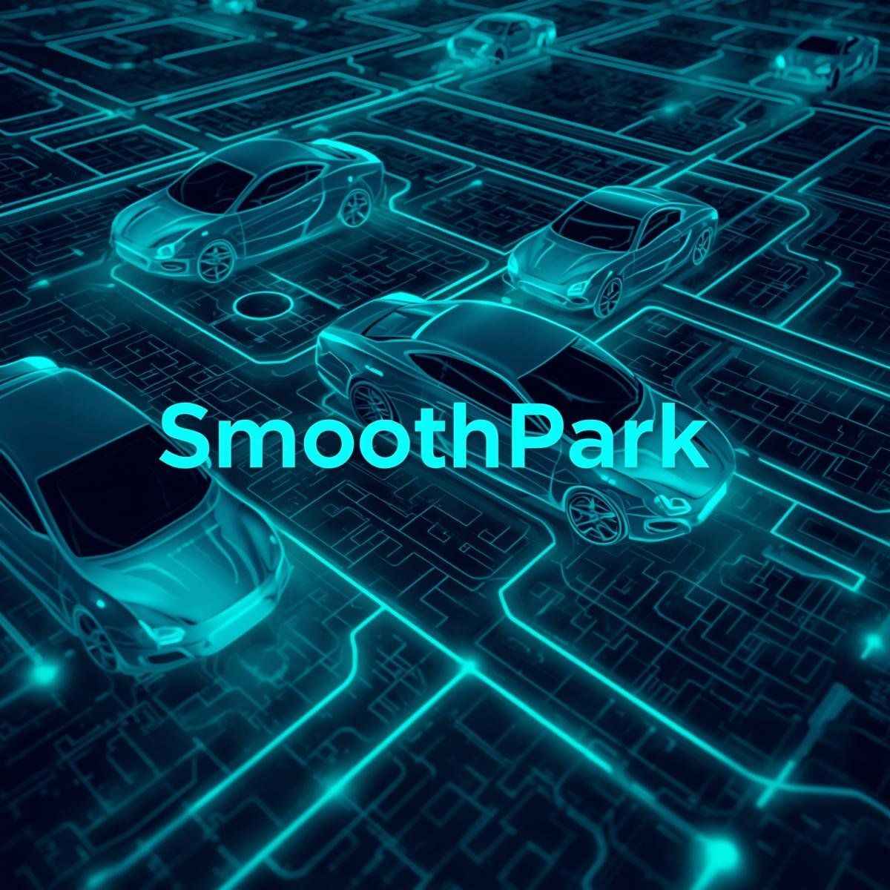

# 🚗 SmoothPark: An AI-Powered Parking spot predictor

<div align="center">
  
</div>
  <br>
  <em>A Project by VIT students (Artificial Intelligence and Machine Learning)</em>
</div>

## 📋 Table of Contents
- [Introduction](#introduction)
- [Problem Statement](#problem-statement)
- [Features](#features)
- [System Architecture](#system-architecture)
- [Implementation](#implementation)
- [Advantages](#advantages)
- [Screenshots](#screenshots)
- [Team Members](#team-members)
- [Installation](#installation)
- [References](#references)

## 🚀 Introduction

A sleek and user-friendly profile interface for SmoothPark—a platform offering decentralized parking solutions. This page enables users to manage account details, vehicles, payment methods, and track usage history.

With increasing urbanization, parking space management has become a growing concern in smart cities. This project addresses the pressing need for a scalable, intelligent, and user-friendly smart parking system, aligning with modern urban planning goals and sustainability initiatives.

## ❓ Problem Statement

Parking congestion is a major urban challenge that leads to increased traffic, fuel consumption, and frustration. The traditional method of searching for parking manually is inefficient and time-consuming.

**Key Challenges:**
- Lack of real-time parking space visibility
- Wastage of fuel and time due to manual search
- Inefficient monetization of private parking spaces
- No centralized platform for smart parking solutions

## ✨ Features

### For Users
- **Real-time parking search and booking**
- **AI-based parking recommendations**
- **Booking history and favorites**
- **Dark/light theme support**
- **Profile management**

### For Parking Space Owners
- **List available parking spaces**
- **View and manage bookings**
- **Track income and space usage**

### For Administrators
- **View all registered users**
- **Manage listings and moderate reported content**
- **Analytics and report generation** (future scope)

## 🏗️ System Architecture

ParkIn uses a layered architecture comprising:

- **Presentation Layer:** React Native UI components
- **Application Layer:** Business logic, API handling
- **Data Layer:** Firebase for authentication, MongoDB for storage
- **AI Layer:** Recommender system (Python Flask API)

## 💻 Implementation

- Developed using **React Native** and **TailwindCSS** for modern UI
- **Firebase authentication** used for user management
- Mock data simulates booking, history, and favorites
- Modular code with future-proof architecture for IoT and AI integration

## 📱 Requirements

### Functional Requirements
- User registration and authentication
- Real-time parking search and booking
- Parking listing by owners
- AI-based recommendation engine
- User profile and booking history
- Dark/light theme support

### Non-Functional Requirements
- High performance
- User-friendly UI/UX
- Secure authentication and data storage
- Scalability
- Platform independence

### Hardware and Software Requirements
- Android/iOS device
- Firebase / MongoDB / Node.js Backend
- React Native frontend framework
- Internet connectivity

## 📈 Advantages

- **Cost Effective:** Minimal infrastructure needed; reuses user GPS and maps
- **Environment Friendly:** Reduces CO₂ emissions by optimizing parking search time
- **Highly Available:** Available on both Android and iOS via cloud sync
- **Easy to Use:** User-centric interface inspired by Zomato/Ola
- **Highly Scalable:** Cloud-ready and supports microservices for AI/IoT modules
- **Robust:** Secure authentication, fault-tolerant codebase

## 📸 Screenshots

<div align="center">
  
  
  
  
  
</div>

## 👥 Team Members

| Name | Roll | LinkedIn |
|------|------|----------|
| **Rakesh G** | 24BEC0242 | [LinkedIn](https://www.linkedin.com/in/rakesh-g-261666350?utm_source=share&utm_campaign=share_via&utm_content=profile&utm_medium=ios_app) |
| **Nithin Raj I** | 24BME0660 | [LinkedIn](https://www.linkedin.com/in/nithin-raj-i-0ba174333?utm_source=share&utm_campaign=share_via&utm_content=profile&utm_medium=android_app) |
| **Sanjay Guptha R S** | 24MIS0461 | [LinkedIn](https://www.linkedin.com/in/sanjay-guptha-a705b8378?utm_source=share&utm_campaign=share_via&utm_content=profile&utm_medium=android_app) |


## ⚠️ Disclaimer

**IMPORTANT:** For presentation and demonstration purposes, the current version of this project uses only HTML, CSS, Python and JavaScript. The fully functional mobile application with React Native and complete backend implementation is currently under development.


<div align="center">
  <p>© 2025 SmoothPark</p>
  <p>Made by Students at Vellore Institute of Technology in Domain of AI and ML</p>
  
  <br>
  
  <a href="LICENSE">
    
  </a>
</div>

## 📜 License

This project is licensed under the MIT License - see the [LICENSE](LICENSE) file for details.

```
MIT License

Copyright (c) 2025 Smoothpark

Permission is hereby granted, free of charge, to any person obtaining a copy
of this software and associated documentation files (the "Software"), to deal
in the Software without restriction, including without limitation the rights
to use, copy, modify, merge, publish, distribute, sublicense, and/or sell
copies of the Software, and to permit persons to whom the Software is
furnished to do so, subject to the following conditions:

The above copyright notice and this permission notice shall be included in all
copies or substantial portions of the Software.

THE SOFTWARE IS PROVIDED "AS IS", WITHOUT WARRANTY OF ANY KIND, EXPRESS OR
IMPLIED, INCLUDING BUT NOT LIMITED TO THE WARRANTIES OF MERCHANTABILITY,
FITNESS FOR A PARTICULAR PURPOSE AND NONINFRINGEMENT. IN NO EVENT SHALL THE
AUTHORS OR COPYRIGHT HOLDERS BE LIABLE FOR ANY CLAIM, DAMAGES OR OTHER
LIABILITY, WHETHER IN AN ACTION OF CONTRACT, TORT OR OTHERWISE, ARISING FROM,
OUT OF OR IN CONNECTION WITH THE SOFTWARE OR THE USE OR OTHER DEALINGS IN THE
SOFTWARE.
```
